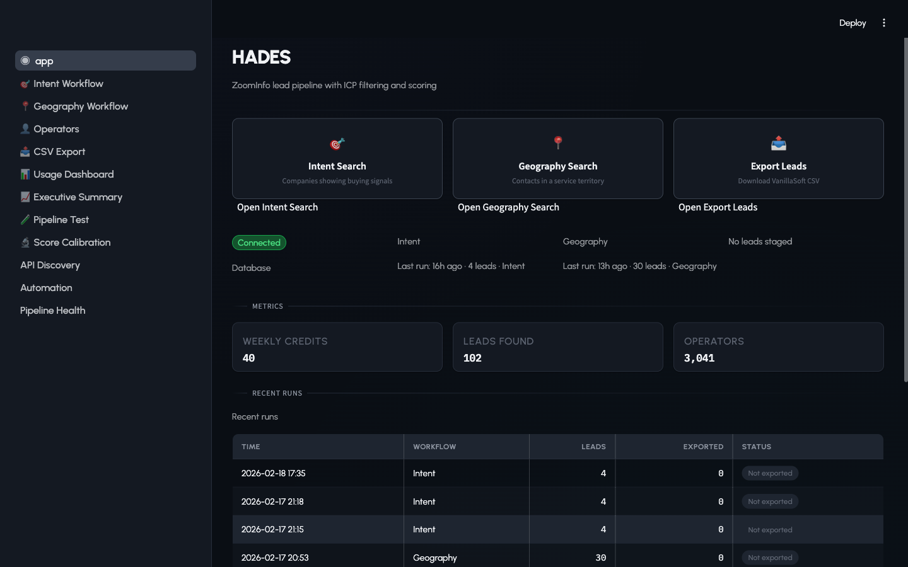
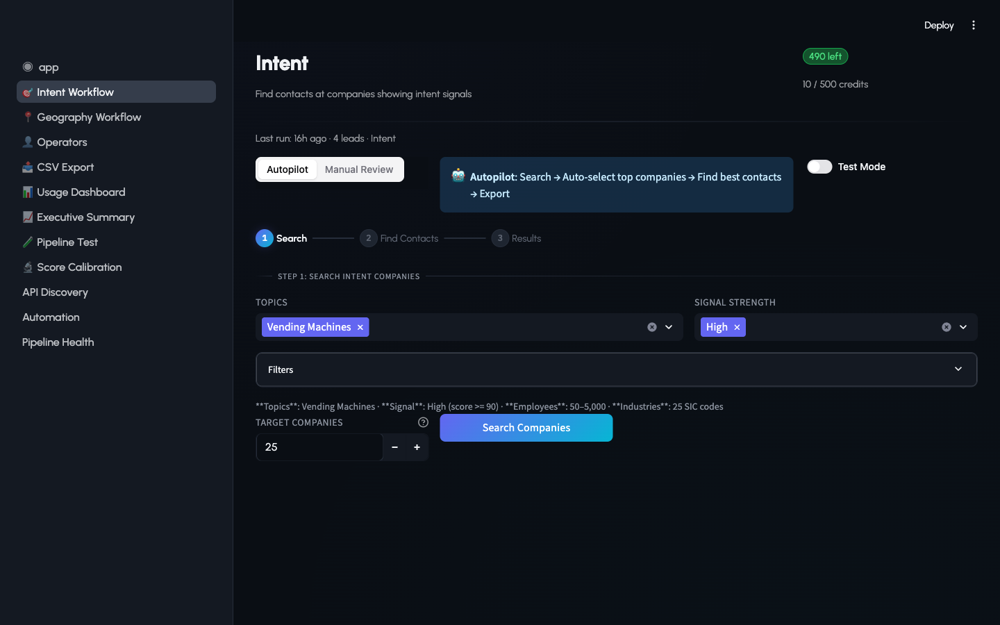
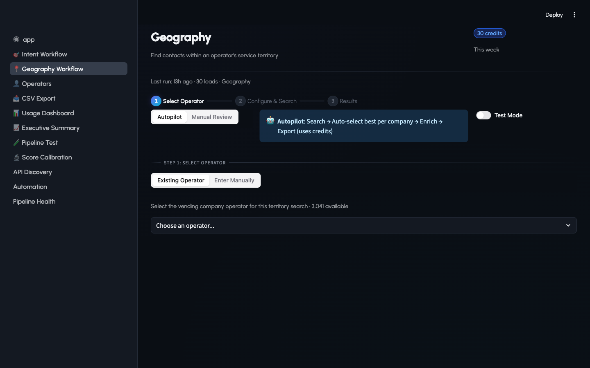
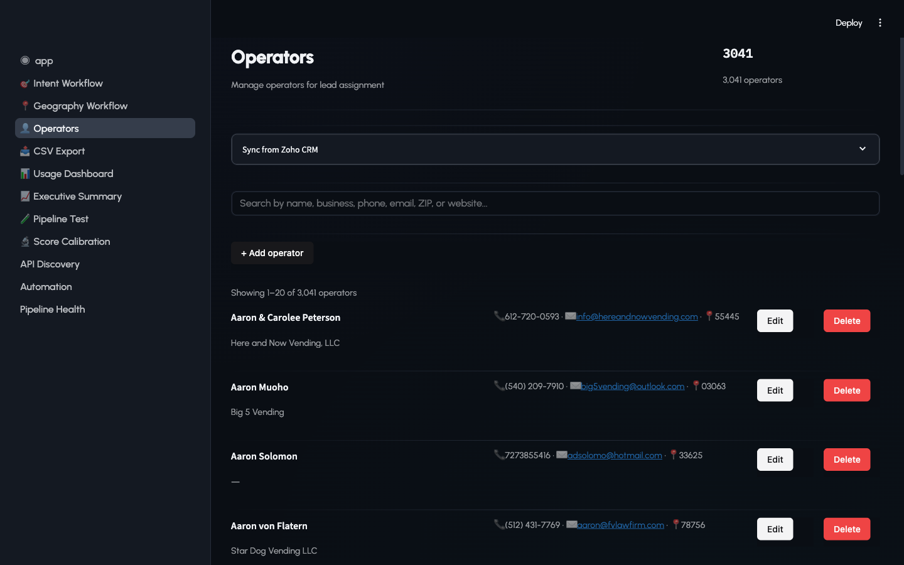
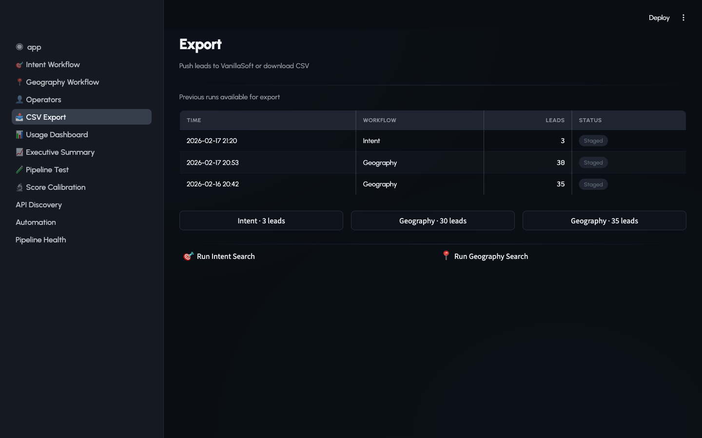
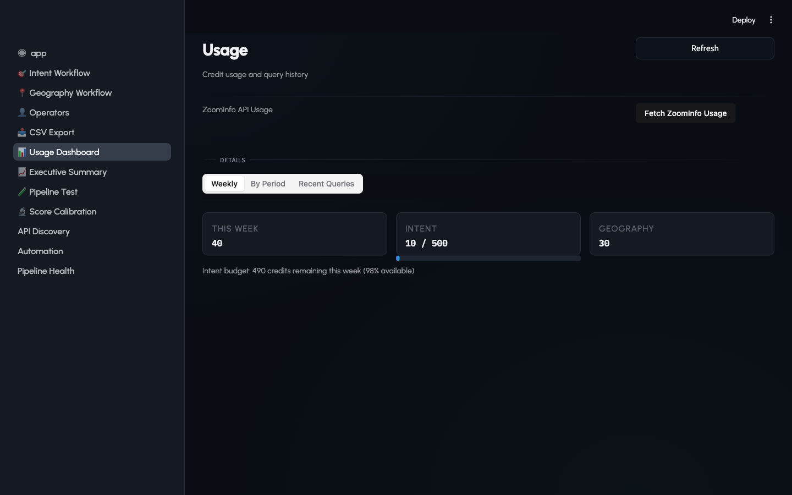
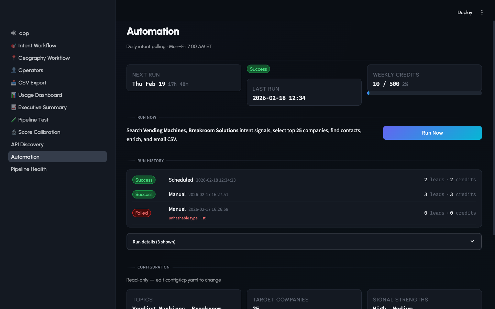
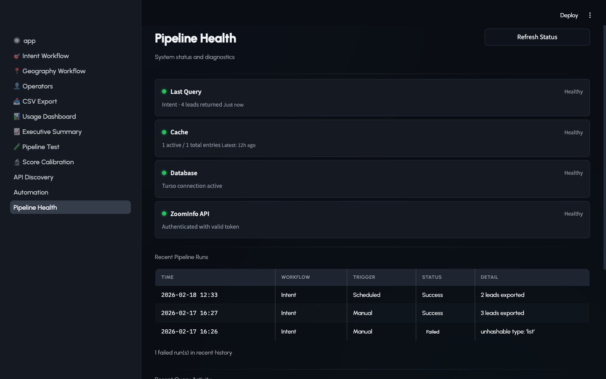

# HADES — Lead Generation Platform

**Prepared for:** Damione
**Date:** February 18, 2026

---

## What Is HADES?

HADES is a web-based tool that finds potential customers for our vending services business. It connects to **ZoomInfo** (a massive business contact database) to search for the right people at the right companies — then scores, organizes, and exports those leads so our sales team can start calling.

Think of it as a smart funnel: millions of businesses go in, and only the contacts most likely to buy vending services come out.

---

## The Home Screen

This is the dashboard you see when you open HADES. At a glance you can see:

- **Quick-action cards** — Jump straight to Intent Search, Geography Search, or Export
- **System status** — Database connection, last run times, and whether leads are staged for export
- **Key metrics** — Weekly API credits used, total leads found, and number of operators in the system
- **Recent runs** — A log of every search run with timestamps, lead counts, and export status

---

## Two Ways to Find Leads

HADES has two distinct search workflows, each designed for a different sales strategy.

### 1. Intent Search — "Who's actively looking for vending?"

This workflow finds companies that are **currently researching vending machines or breakroom solutions** online. ZoomInfo tracks this "buying intent" — when a company's employees visit vending-related websites, read industry articles, or search for related terms.

**How it works:**
- Pick topics (e.g., "Vending Machines") and signal strength (High/Medium)
- Set a target number of companies (default: 25)
- Hit **Search Companies** — HADES queries ZoomInfo's Intent API
- The system automatically finds the best contact at each company (managers, facility directors)
- Contacts are scored and staged for export

**Why it matters:** These are warm leads — companies already thinking about vending. The weekly credit budget (500 credits) keeps costs controlled, and the system runs automatically every weekday morning at 7 AM.

### 2. Geography Search — "Who's in this operator's territory?"

This workflow finds contacts near a specific operator's service area using ZIP code radius searches. Unlike Intent, Geography searches have **no credit cap** — search as much as you need.

**How it works:**
- Select an operator from the database (3,041 available)
- Enter a center ZIP code and radius (or paste a manual list of ZIP codes)
- HADES calculates all ZIP codes within that radius and queries ZoomInfo
- Contacts are filtered by industry, company size, and job title
- If the initial search doesn't hit the target count, the system automatically expands — adding management levels, broadening employee ranges, or increasing radius

**The step indicator** at the top tracks your progress: Select Operator → Configure & Search → Results.

---

## Operators — Your Sales Territory Database

Operators are vending company owners — your potential customers or existing partners. HADES stores over **3,000 operators** with their:

- Name, business name, phone, email
- ZIP code (used as the center point for Geography searches)
- Team assignment

You can search, add, edit, or delete operators. The database syncs from Zoho CRM.

---

## Export — Getting Leads to the Sales Team

Once leads are found and scored, they need to get into VanillaSoft (our call center software). The Export page shows all staged batches with lead counts and workflow type.

**Two export options:**
- **Push to VanillaSoft** — Sends leads directly into VanillaSoft's queue via their API. One click, leads appear in the dialer.
- **Download CSV** — Generates a formatted CSV file with all 31 VanillaSoft fields for manual import.

Each export can be tagged with an operator to track which territory the leads belong to.

---

## Usage Dashboard — Budget at a Glance

ZoomInfo charges per API credit, so we track every penny. The Usage Dashboard shows:

- **This week's total credits** used across both workflows
- **Intent budget** — 10 of 500 weekly credits used (2%) with a visual progress bar
- **Geography credits** — tracked separately (unlimited)
- Tabs for Weekly breakdown, By Period analysis, and Recent Query history

The weekly cap and alert thresholds (50%, 80%, 95%) prevent accidental overspending.

---

## Executive Summary — The Big Picture

This is the page you'd show in a meeting. It answers "how is lead generation going this month?"

- **118 leads exported this month** at 0.84 credits per lead — that's efficiency
- **Credit usage** — 10 of 500 weekly intent credits used
- **Geography activity** — 5 searches, 34 leads found (no credit cap)
- **Workflow comparison chart** — Bar graph showing Geography vs. Intent volume
- **Efficiency table** — Credits per lead by workflow type (Geography: 1.00, Intent: 1.29)

Tabs for Overview, Trends, and Budget let you drill into different angles.

---

## Automation — Hands-Free Lead Generation

The Intent pipeline runs automatically on a schedule — **Monday through Friday at 7:00 AM Eastern**. No one needs to log in and click buttons.

This page shows:
- **Next scheduled run** with countdown
- **Last run results** — status, timestamp, leads found
- **Run History** — Success/Failed badges with credit consumption
- **Run Now** button — Trigger an immediate run if you don't want to wait
- **Configuration** — Read-only view of the current search settings (topics, target companies, signal strengths)

---

## Pipeline Health — Is Everything Working?

This is the system diagnostics page. Four health indicators show green/yellow/red status for:

- **Last Query** — When was the last successful search?
- **Cache** — Are cached results fresh?
- **Database** — Is the Turso cloud database connected?
- **ZoomInfo API** — Is authentication valid?

Below that, a **Recent Pipeline Runs** table shows every automated and manual run with timestamps, triggers, status badges, and details. If something breaks, this is where you look first.

---

## Security

The app is password-protected when deployed. Users must enter a password to access any page. Locally, it runs without a password for development convenience.

---

## Summary

| Capability | What It Does |
|-----------|-------------|
| **Intent Search** | Finds companies actively researching vending — warm leads |
| **Geography Search** | Finds contacts near an operator's territory — territory coverage |
| **Scoring Engine** | Ranks leads by signal strength, proximity, and data freshness |
| **Operators** | 3,000+ vending company database with CRM sync |
| **Export** | Push directly to VanillaSoft or download CSV |
| **Automation** | Daily scheduled searches with budget controls |
| **Usage Tracking** | Credit monitoring with weekly caps and alerts |
| **Health Monitoring** | Real-time status for database, API, and cache |

HADES turns a manual, time-consuming lead research process into an automated pipeline. The sales team gets scored, territory-assigned leads in VanillaSoft every morning without anyone touching the app.
